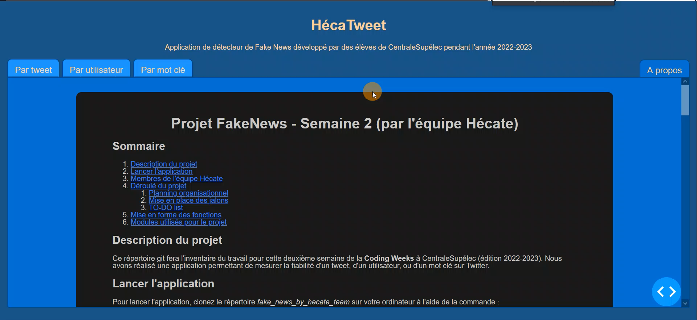
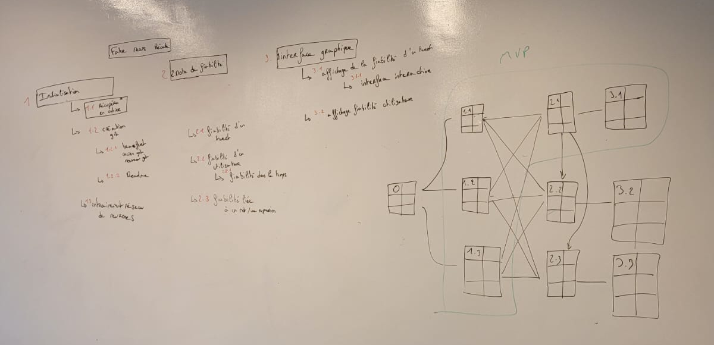

# Projet FakeNews - Semaine 2 (par l'équipe Hécate)

## Sommaire

1. [Description du projet](#description-du-projet)
2. [Lancer l'application](#lancer-lapplication)
3. [Membres de l'équipe Hécate](#membres-de-léquipe-hécate)
4. [Déroulé du projet](#déroulé-du-projet)
    1. [Planning organisationnel](#planning-organisationnel)
    2. [Mise en place des jalons](#mise-en-place-des-jalons)
    3. [TO-DO list](#to-do-list)
5. [Mise en forme des fonctions](#mise-en-forme-des-fonctions)
6. [Modules utilisés pour le projet](#modules-utilisés-pour-le-projet)

## Description du projet

Ce répertoire git fera l'inventaire du travail pour cette deuxième semaine de la **Coding Weeks** à CentraleSupélec (édition 2022-2023).

Nous avons réalisé une application permettant de mesurer la fiabilité d'un tweet, d'un utilisateur, ou d'un mot clé sur Twitter.

Vous pouvez visualiser un aperçu de l'utilisation du site grâce à la vidéo suivante : [](./working_docs/apercu_utilisation.mp4)

## Lancer l'application

1. Pour lancer l'application, clonez le répertoire *fake_news_by_hecate_team* sur votre ordinateur à l'aide de la commande :

```bash
git clone <lien-du-fichier-à-cloner>
```

2. Pour s'assurer que l'ensemble des modules requis est bien installé, veuillez installer les modules requis à l'aide de la comande suivante :

```python
pip install -r requirements.txt
```

3. Créez un fichier *credentials.py* dans le répertoire *back/tweet_collection*. Ce fichier apparaîtra seulement sur votre répertoire local et non distant. Ce fichier permettra de faire des requêtes à l'API Twitter. Voici le template de ce fichier :

```python
# Twitter App access keys for @user

# Consume:
CONSUMER_KEY = ''
CONSUMER_SECRET = ''

# Access:
ACCESS_TOKEN = ''
ACCESS_SECRET = ''
```

4. Puis ouvrez un terminal et placez vous dans le répertoire principal afin d'exécuter le fichier *index.py* avec la commande :

```bash
python index.py
```

Si l'exécution ne se déroule pas convenablement, les contacts des développeurs.ses sont disponibles [ici](#membres-de-léquipe-hécate) dans le README.

## Membres de l'équipe Hécate

En cas de problèmes liés à l'utilisation de noter application, n'hésitez pas à contacter l'un de nos membres:

- Alexandre Faure ([alexandre.faure@student-cs.fr](mailto:alexandre.faure@student-cs.fr))
- Antoine Vicente ([antoine.vicente@student-cs.fr](mailto:antoine.vicente@student-cs.fr))
- Gautier Bonjour ([gautier.bonjour@student-cs.fr](mailto:gautier.bonjour@student-cs.fr))
- Hugo De Bosschere ([hugo.debosschere@student-cs.fr](mailto:hugo.debosschere@student-cs.fr))
- Iris Wang ([iris.wang@student-cs.fr](mailto:iris.wang@student-cs.fr))

## Déroulé du projet

### Planning organisationnel



### Mise en place des jalons

La liste des jalons et leur état de validation sont disponibles à l'adresse suivante : [jalons](https://trello.com/b/c1llsKoM/jalons).

#### Sprint 0

- Installation du socle technique (Création nouveau Git, transfert des fonctions intéressantes de la première semaine)
- Analyse des besoins
- Réflexion autour de la conception (déterminer les fonctionnalités, l’architecture du projet, l’interface graphique)

#### Sprint 1

- Mise en place d’un MVP en se basant sur l’émotion et la subjectivité des tweets, à l’aide de TextBlob
- Rédaction du README

#### Sprint 2

- Entrainement d’un réseau de neurone pour la détection de fake news
- Modification des fonctions récupérées de la semaine 1 pour les adapter à notre projet
- Mise en place de nouvelles fonctions nécessaires
- Mise en place de tests et commentaires

#### Sprint 3

- Mise en place de l’interface graphique : site en local
- Mise en place d’un onglet « à propos »
- Mise en place d’un onglet d’affichage de tweets
- Affichage du résultat de l’analyse de l’Intelligence Artificielle sous forme de pourcentage.

#### Sprint 4

- Relecture du code (vérification des commentaires, des tests, de l’arborescence du code)
- Nettoyage du Git
- Création du PowerPoint pur la soutenance

### TO-DO list

Le planning des tâches,  se trouve à l'adresse suivante : [déroulé des tâches](https://trello.com/b/EFogVE4L/organisation).

## Mise en forme des fonctions

Afin de garantir la cohérence du code et plus généralement du code, le choix a été fait de rédiger les *fichiers Markdown* (incluant le README.md) en français.

Les fonctions sont elles rédigées en anglais avec le format suivant :

```python
def my_function(param1, param2, param3):
    """
    The function my_function aims to do this and that.

    The parameters used are
    :param param1: this param represents this and is of type that.
    :param param2: this other param represents that and is of type this.
    :param param3: this last param represents this and is of type that.

    my_function return this object.
    """
    definition of my function

    return my_result
```

## Modules utilisés pour le projet

L'ensemble des modules utilisés est décrit dans le tableau suivant :

| Nom du module     | Description                    | Documentation            | Télécharger le module       |
| :---------------: | :---------------              | :----------------------: | :------------------------- |
| Tweepy | Permet de faire des opération élémentaires sur Twitter, principalement récupérer des tweets selon différents critères. | [Documentation](https://docs.tweepy.org/en/stable/index.html) | ```pip install tweepy``` |
| Dash | Permet de créer une interface graphique à l'aide d'un site internet en local pour afficher l'application. | [Documentation](https://dash.plotly.com/) | ```pip install dash``` |
| Gdown | Permet d'importer le dataset qui va permettre d'entraîner le réseau de neurone responsable de l'évaluation de la fiabilité d'un tweet. | [Documentation](https://pypi.org/project/gdown/) | ```pip install gdown``` |
| Transformers | Permet de manipuler des chaînes de caractères et notamment les traduire, en extraire des informations... | [Documentation](https://pypi.org/project/transformers/) | ```pip install transformers``` |
| NLTK | Permet de gérer les chaînes de caractères et notamment de traduire ou extraire des parties du contenu. | [Documentation](https://www.nltk.org/) | ```pip install -U nltk``` |
| Pandas | Permet de gérer les dataframes et de manipuler des bases de données à partir de fichiers *json* ou *csv*. | [Documentation](https://pandas.pydata.org/) | ```pip install pandas``` |
| Numpy | Permet de faire des opérations sur des tableaux rapidement et facilement et fournit un grand nombre d'opérations mathématiques. | [Documentation](https://numpy.org/) | ```pip install numpy``` |
| Matplotlib | Permet de gérer l'affichage de graphiques. | [Documentation](https://matplotlib.org/stable/tutorials/introductory/pyplot.html) | ```pip install matplotlib``` |
| Pytest | Permet de gérer les tests des différentes fonctions afin de s'assurer du bon fonctionnement de chaque module. | [Documentation](https://docs.pytest.org/en/7.2.x/) | ```pip install pytest``` |
| Sklearn | Permet d'implémenter des modèles de machine learning. | [Documentation](https://scikit-learn.org/stable/) | ```pip install -U scikit-learn``` |
| Plotly Express | Permet de réaliser de la visualisation interractive de données (graphiques) | [Documentation](https://plotly.com/python/plotly-express/) | ```pip install plotly``` |
| CSV | Permet d'implémenter des classes pour lire et écrire des données au format CSV | [Documentation](https://docs.python.org/3/library/csv.html) | ```pip install python-csv``` |
| Regex | Permet de vérifier la présence de certains caractères ou suites de caractères dans une expression | [Documentation](https://docs.python.org/3/howto/regex.html) | ```pip install regex``` |
| Torch | Permet d'implémenter en partie une intelligence artificielle | [Documentation](https://pytorch.org/docs/stable/index.html) | ```pip install torch``` |
| CarbonAI | Permet de mesurer la consommation du projet | [Documentation](https://capgemini-invent-france.github.io/CarbonAI/) | ```pip install carbonai``` |
| Coverage | Complément à pytest, affiche le % de couverture des tests | [Documentation](https://coverage.readthedocs.io/en/6.5.0/) | ```pip3 install coverage``` |
| Pytest-Cov | Complément à pytest, affiche le % de couverture des tests | [Documentation](https://pytest-cov.readthedocs.io/en/latest/) | ```pip install pytest-cov``` |
